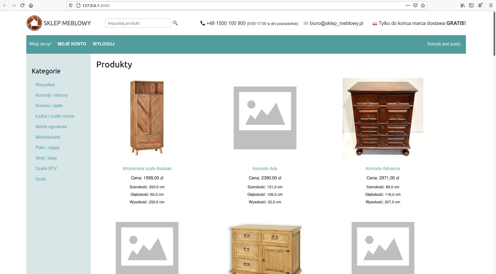
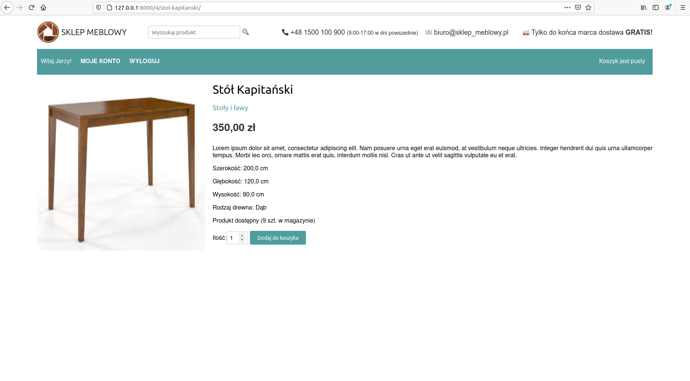
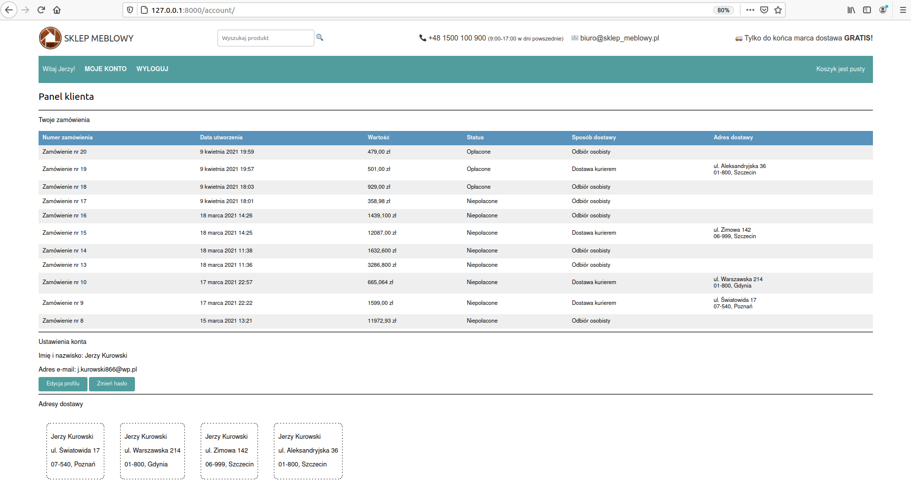
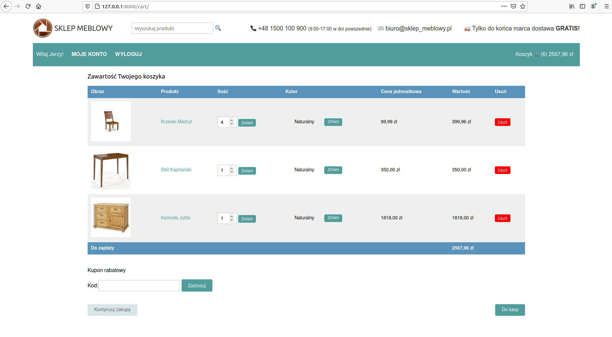
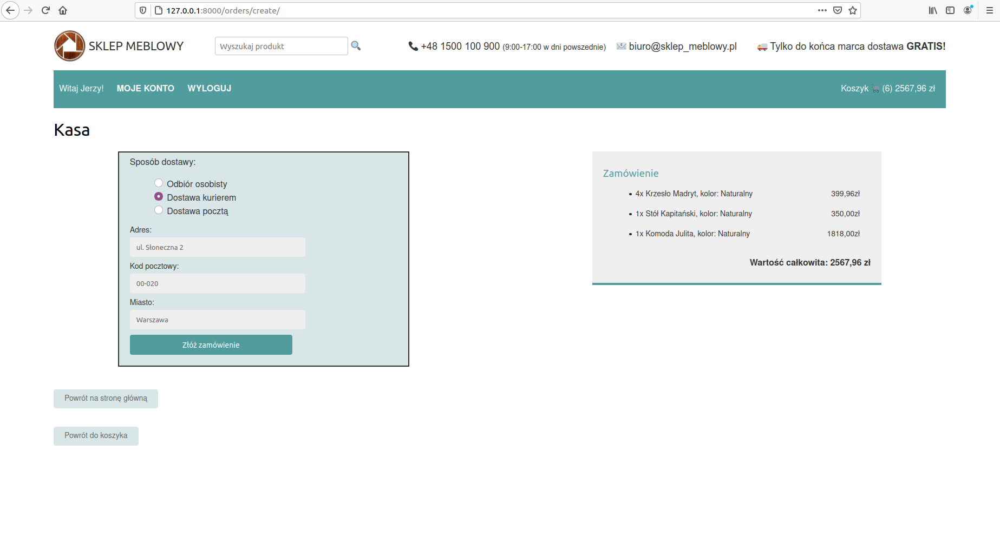

# Furniture shop
A simple e-commerce web aplication built with Django Framework.

## General Info
An online furniture shop, that allows users to choose pieces of furniture from the list of available products, add them to their shopping cart and fulfill the order. It was created as a final project for CodersLab online course.

## Technologies:
- Python
- Django
- JavaScript
- HTML
- CSS

## Features:

## Screenshots
Landing Page:



Product detail:



User Panel:



Shopping Cart:



Checkout:



## Setup

First you should clone this repository:
```
git clone https://github.com/JKK86/furniture_shop.git
cd  furniture_shop
```

To run the project you should have Python 3 installed on your computer. Then it's recommended to create a virtual environment for your projects dependencies. To install virtual environment:
```
pip install virtualenv
```
Then run the following command in the project directory:
```
virtualenv venv
```
That will create a new folder venv in your project directory. Next activate virtual environment:
```
source venv/bin/active
```
Then install the project dependencies:
```
pip install -r requirements.txt
```
Now you can run the project with this command:
```
python manage.py runserver
```
**Note** if you want payments to work you will need to enter your own Braintree keys in the settings file.

**Note** in the settings file you should complete your own database settings.

